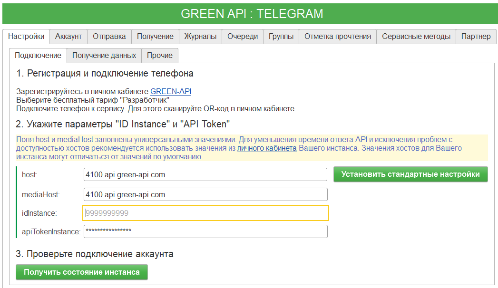
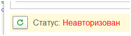
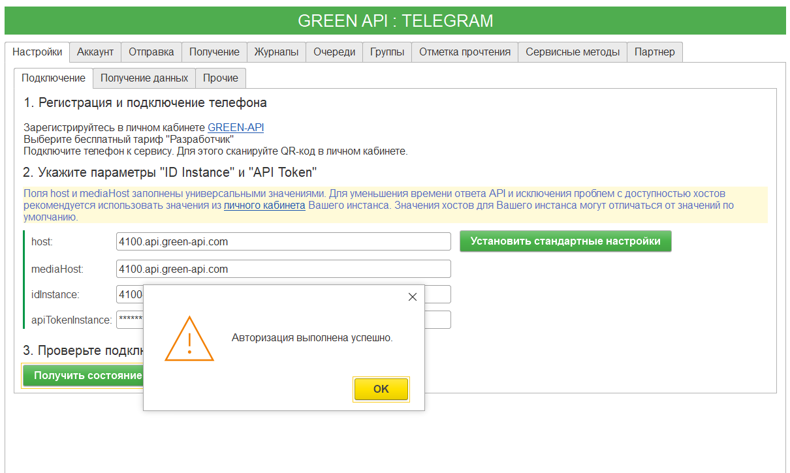

# Демо обработка для работы с Telegram из 1С  

Репозиторий представляет собой исходники конфигурации в формате выгрузки xml файлов с одной обработкой. Из обработки можно отправить сообщение в мессенджер Telegram. Интеграция с Telegram сделана через REST сервис [green-api.com](https://green-api.com/Telegram)  

Данная обработка создана на основе ранее разработанной обработки интеграции [WhatsApp с GREEN-API](https://github.com/green-api/whatsapp-api-client-1c).  

В процессе разработки была сохранена общая архитектура, логика взаимодействия с API и структура интерфейса, что обеспечивает единый подход к работе с мессенджерами в 1С.  

При этом обработка была адаптирована под особенности мессенджера Telegram, включая авторизацтю по QR-коду.  

## Оглавление  

* [Требования](#Требования)  
* [Важные отличия Telegram от WhatsApp](#Важные-отличия-Telegram-от-WhatsApp)  
  * [Основные отличия](#основные-отличия)  
* [Возможности обработки](#возможности-обработки)  
* [Регистрация и подготовка](#регистрация-и-подготовка)  
  * [Процесс авторизации инстанса Telegram (через QR-код)](#процесс-авторизации-инстанса-Telegram-через-qr-код)  
  * [Подключение Telegram в обработке](#подключение-Telegram-в-обработке)  
  * [Отправка сообщений](#отправка-сообщений)  
  * [Получение сообщений](#получение-сообщений)  
  * [Журналы и очереди](#журналы-и-очереди)  
  * [Группы](#группы)  
* [Работа с контактами и сообщениями](#работа-с-контактами-и-сообщениями)  
* [Партнёрский режим GREEN-API](#партнёрский-режим-green-api)  
* [Использование обработки в собственных конфигурациях](#использование-обработки-в-собственных-конфигурациях)  
  * [Отправка сообщения в чат](#отправка-сообщения-в-чат)  
  * [Отправка сообщения в группу](#отправка-сообщения-в-группу)  
* [Установка обработки из исходников](#установка-обработки-из-исходников)  


## Требования  
* Для запуска обработки нужна Платформа 1С не ниже версии 8.3.10.  
* Для загрузки исходников нужно Платформа 1С не ниже версии 8.3.16.1063  

## Важные отличия Telegram от WhatsApp  

При работе с мессенджером Telegram через GREEN-API существуют принципиальные отличия от интеграции WhatsApp, которые важно учитывать при разработке и эксплуатации.  

### Основные отличия  

* **Отсутствие привязки к телефону**  
Инстанс Telegram не зависит от постоянного подключения мобильного устройства к интернету, что повышает стабильность работы.  

* **Более простое повторное подключение**  
В большинстве случаев повторная авторизация не требуется, даже при перезапуске инстанса.  

* **Работа с группами**  
Групповые чаты идентифицируются ID, начинающимся со знака -, аналогично WhatsApp, но управление группами не требует подтверждений на телефоне.  

* **Фокус на серверное использование**  
API мессенджера Telegram лучше подходит для серверных сценариев, ботов, CRM и интеграций с 1С без участия пользователя.  

Детальное описание отличий доступно в [официальной документации API мессенджера Telegram](https://green-api.com/telegram/docs/important-differences).

## Возможности обработки  

* Отправка текстовых сообщений  
* Отправка и получение файлов  
* Работа с групповыми чатами  
* Получение входящих сообщений  
* Журналы входящих и исходящих сообщений  
* Очереди сообщений  
* Отметка сообщений как прочитанных  
* Webhook-уведомления  
* Сервисные методы управления инстансом  

## Регистрация и подготовка  

1. Зарегистрируйтесь в [личном кабинете GREEN-API](https://console.green-api.com)  
2. Создайте инстанс Telegram  
3. Получите ID Instance и API Token  

### Процесс авторизации инстанса Telegram (через QR-код)  

Авторизация выполняется на вкладке `Настройки` -> `Подключение` и завязана на кнопку `Получить состояние инстанса`.  

Шаг 1. Запрос состояния инстанса  
1. Заполните параметры подключения (`host`, `mediaHost`, `idInstance`, `apiTokenInstance`).
2. Нажмите `Получить состояние инстанса`.  

  

Шаг 2. Если текущий статус инстанса - «Неавторизован»

1. Обработка автоматически покажет QR-код (в блоке под кнопкой).
2. Отсканируте QR-код телефоном в приложении Telegram.

Шаг 3. Подтверждение после сканирования  

После того как QR-код отсканирован телефоном:
1. Нажмите кнопку обновления (кнопка с круговой стрелкой / обновить);

  

2. Повторно нажмите «Получить состояние инстанса».  
После обновления статус изменится на «Авторизован».  

**Что будет, если инстанс уже авторизован**  

  

Если при нажатии «Получить состояние инстанса» инстанс уже в статусе «Авторизован», появится сообщение:  

«Авторизация выполнена успешно.»  
Примечание: QR-код отображается только когда инстанс не авторизован.  

### Подключение Telegram в обработке  

1. [Скачать обработку](https://github.com/green-api/telegram-api-client-1c/releases/download/1.0.0/GreenAPI-Telegram.epf) в формате epf  
2. Подключиться к сервису через встроенный в обработку помощник или  самостоятельно через сайт [green-api.com](https://green-api.com/). Получить ``API Token`` и ``ID Instance``  
3. В разделе «Настройки → Подключение» укажите:  
  * host - api.green-api.com  
  * hostMedia - media.green-api.com  
  * idInstance - ID вашего инстанса  
  * apiTokenInstance - API Token  
4. Сканировать QR-код с мобильного телефона Telegram  
5. В форме обработки нажать кнопку ``Проверить подключение / Сканировать QR Код``. Поле формы статус должно изменится на "Подключен"  

Обработка работает либо с личным чатом, либо с группой - режим определяется автоматически на основании значения, указанного в поле «ID чата».  
* Если в поле «ID чата» указан идентификатор без знака -, сообщения отправляются в личный чат.
* Если ID чата начинается со знака -, сообщения отправляются в групповой чат.  

### Отправка сообщений  

Поддерживается отправка:  
* текста  
* файлов (локально и по URL)  
* геолокации  
* контактов  
* уведомлений о наборе текста  

### Получение сообщений  

Получение сообщений выполняется в разделе Получение и работает в режиме ожидания входящих уведомлений.  

**Режим ожидания сообщений**  

При нажатии на кнопку «Ожидать сообщения» обработка переходит в режим ожидания входящих сообщений.  

В этом режиме:  
* обработка регулярно обращается к API GREEN-API;  
* входящие сообщения получаются по одному;  
* каждое полученное сообщение выводится в поле «Ответ»;  
* кнопка «Ожидать сообщения» меняет название на «Прекратить ожидать сообщения», что означает активный режим ожидания.  

Обработка продолжает получать сообщения до тех пор, пока во входящей очереди есть данные.

**Завершение получения сообщений**  

Когда все входящие сообщения обработаны и новых сообщений во входящей очереди нет, обработка автоматически завершает получение и выводит сообщение: **«Нет сообщений»**.  

После этого режим ожидания считается завершённым.  

**Прерывание ожидания вручную**  

В любой момент пользователь может нажать кнопку **«Прекратить ожидать сообщения»**.

В этом случае:  

* процесс ожидания немедленно останавливается;  
* дальнейшее получение сообщений прекращается;  
* обработка возвращается в обычный режим работы.  

**Рекомендации по использованию**  

Для автоматизированных сценариев рекомендуется выполнять получение сообщений:  
* в фоновом задании;  
* с небольшим интервалом (например, 10 секунд).  

Такой подход позволяет стабильно обрабатывать входящие сообщения без перегрузки API.  

### Журналы и очереди  

Доступны журналы сообщений и управление очередями отправки и получения.  

### Группы  

* Создание и управление группами  
* Добавление и удаление участников  
* Назначение администраторов  
* Изменение имени и аватара  

## Работа с контактами и сообщениями  

В разделе **Сервисные методы** доступны операции для работы с контактами, сообщениями и чатами.

**Проверка наличия получателя в Telegram**  

Кнопка **«Проверить наличие Telegram»** позволяет проверить, зарегистрирован ли указанный номер телефона в мессенджере Telegram.  

В результате выполнения:  

* в поле «Ответ» отображается результат проверки;  
* если аккаунт уже авторизован, может быть возвращено сообщение вида: `instance account already authorized`.  

**Получение информации о контактах**  

В разделе доступны следующие операции:  

* **Получить аватар контакта** - получение изображения профиля контакта;  
* **Получить контакты** - получение списка контактов аккаунта;  
* **Получить информацию о контакте** - получение детальной информации по указанному номеру телефона.  

Для выполнения операций необходимо указать ID чата в соответствующих полях.  

**Работа с сообщениями**  

Также доступны операции:  

* Удалить сообщение - удаление сообщения по ID;  
* Изменить сообщение - редактирование ранее отправленного сообщения;  
* Получить список чатов - получение списка доступных чатов;  
* Отправить уведомление о наборе текста - отображение статуса «набор сообщения» у получателя.  

## Партнёрский режим GREEN-API  

Раздел **Партнёр** предназначен для работы по партнёрской схеме GREEN-API и управления несколькими инстансами.  

**Возможности партнёрского режима**

Партнёрская схема работы позволяет:  
* управлять большим количеством инстансов;  
* получать список созданных инстансов;  
* создавать новые инстансы;  
* удалять существующие инстансы;  
* использовать расширенные условия обслуживания и поддержки.  

**Работа с инстансами**  

Для работы необходимо указать **Partner token**.  

Доступные операции:  
* Получить список инстансов - выводит список всех инстансов, доступных партнёру;  
* Создать инстанс - создание нового инстанса;  
* Удалить инстанс - удаление инстанса по его ID.  

Результаты выполнения операций отображаются в поле **«Ответ»**.

## Использование обработки в собственных конфигурациях  

Обработка имеет программный интерфейс, оформленный в соответствии со [стандартами разработки 1С](https://its.1c.ru/db/v8std). Вы можете встроить ее в свою конфигурацию и вызывать АПИ на сервере через создание объекта. Пример использования:

### Отправка сообщения в чат  

```bsl
АПИ = Обработки.GreenAPI.Создать();
АПИ.IdInstance = "ВАШ_ИНСТАНС";
АПИ.ApiToken = "ВАШ_ТОКЕН";
Ответ = АПИ.ОтправитьТекст("10000000", "Я использую GREEN-API для отправки этого сообщения!"); 
```

### Отправка сообщения в группу  

```bsl
АПИ = Обработки.GreenAPI.Создать();
АПИ.IdInstance = "ВАШ_ИНСТАНС";
АПИ.ApiToken = "ВАШ_ТОКЕН";
Ответ = АПИ.ОтправитьТекст("-10000000000000", "Я использую GREEN-API для отправки этого сообщения!"); 
```

## Установка обработки из исходников  

Исходники в репозитории - это xml выгрузка из конфигуратора 1С версии 8.3.16 в режиме совместимости с 8.3.10. Скачайте исходники с репозитория и загрузите в конфигуратор с помощью команды ``Конфигурация`` -> ``Загрузить конфигурацию из файлов``
